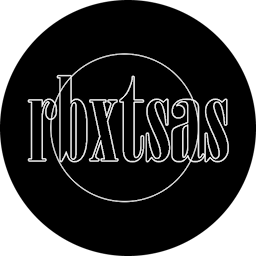

<p align="center">
    
</p>

# rbxts-asset-sync
[](https://github.com/evilbocchi/rbxts-asset-sync/actions/workflows/build-and-release.yml)
[](https://github.com/evilbocchi/rbxts-asset-sync/releases/latest)
[](https://marketplace.visualstudio.com/items?itemName=evilbocchi.rbxtsasvs)
[](https://www.codefactor.io/repository/github/evilbocchi/rbxts-asset-sync)

Local asset CDN pipeline for [roblox-ts](https://roblox-ts.com/).  
**rbxts-asset-sync** automates the process of uploading local asset files (images, audio, models, etc.) to Roblox via the Open Cloud API, and generates a TypeScript asset map for easy asset referencing in your roblox-ts projects.

## Features

- **Automatic Asset Upload:** Uploads assets from a local folder to Roblox using Open Cloud.
- **Asset Map Generation:** Generates a TypeScript file mapping asset paths to `rbxassetid://` IDs.
- **Change Watching:** Optionally watches your asset folder and syncs changes automatically.
- **Caching:** Avoids re-uploading unchanged assets using a hash-based cache.
- **Roblox-ts Integration:** Asset map can be imported and used directly in roblox-ts scripts.
- **VS Code Integration:** Install the [VS Code extension](https://github.com/evilbocchi/rbxts-asset-sync-vscode) to enjoy image/audio previews and information from simply hovering over.

## Installation

```sh
npm install --save-dev rbxts-asset-sync
```

Or use `npx` for one-off usage.

## Setup

1. **Roblox Open Cloud API Key:**  
   - Create an API key with the "Asset Management" permission for your user or group.
   - Set the following environment variables (e.g., in a `.env` file at your project root):

     ```
     ROBLOX_API_KEY=your-api-key-here
     ROBLOX_USER_ID=your-roblox-user-id
     # Optionally, for group uploads:
     # ROBLOX_GROUP_ID=your-group-id
     ```

2. **Project Structure:**  
   Place your assets (e.g., images, audio) in a folder (default: `assets/`).

## Usage

### One-time Sync

Uploads all assets in the watched folder and generates the asset map.

```sh
npx rbxts-asset-sync
```

### Watch Mode

Continuously watches for changes and uploads new/changed assets automatically.

```sh
npx rbxts-asset-sync --watch
```

### Options

- `--path=assets` &nbsp;&nbsp;&nbsp;&nbsp; Set the folder to watch for assets (default: `assets`)
- `--output=assetMap.ts` &nbsp;&nbsp; Set the output path for the generated asset map (default: `assetMap.ts`)
- `--cache=.rbx-sync-cache.json` &nbsp;&nbsp; Set the cache file path

Example:

```sh
npx rbxts-asset-sync --path=assets --output=src/assetMap.ts --watch
```

## Integration with roblox-ts

The tool generates a TypeScript file (default: `assetMap.ts`) like:

```ts
export const assets = {
  "assets/test.png": "rbxassetid://1234567890",
  // ...
} as const;

export function getAsset(path: keyof typeof assets): string {
  return assets[path];
}
```

**Usage in your roblox-ts code:**

```ts
import { getAsset } from "../../assetMap";

const assetId = getAsset("assets/test.png");
// Use assetId with Roblox APIs
```

> Changes to Rojo's file tree and tsconfig.json may be needed if assetMap.ts is *outside* of src, which is the default setting when no parameters are specified. View [default.project.json](example/default.project.json) and [tsconfig.json](example/tsconfig.json) in the example folder for reference.

# Integration with VS Code

The [rbxts-asset-sync VS Code extension](https://github.com/evilbocchi/rbxts-asset-sync-vscode) provides a seamless workflow for working with assets in your roblox-ts projects. With the extension installed:

- **Asset Previews:** Hovering over asset references (such as keys in your generated asset map) shows a preview of the image or audio, along with useful metadata like dimensions or duration.
- **Quick Navigation:** Easily jump to the asset file in your workspace directly from the hover popup.
- **Error Highlighting:** Instantly see if an asset reference is missing or invalid, reducing runtime errors.
- **Contextual Information:** Get additional details about the asset, such as its Roblox asset ID, right in your editor.

These features help you quickly verify asset usage, reduce mistakes, and speed up development by keeping all asset-related information at your fingertips within VS Code.

## Scripts Example

Add to your `package.json`:

```json
{
  "scripts": {
    "asset-sync": "npx rbxts-asset-sync",
    "asset-watch": "npx rbxts-asset-sync --watch"
  }
}
```

## Troubleshooting

- Ensure your API key has the correct permissions.
- Make sure your `.env` file is present and correctly configured.
- If assets are not uploading, check the CLI output for error messages.

# GitHub Asset Map Push

If you want to automatically push a JSON asset map to a GitHub repository after syncing, you can use the `--github` option and a GitHub token. This is useful for sharing asset mappings across projects or CI workflows.

## How to Use

1. **Set up a GitHub Personal Access Token**
   - Go to [GitHub Settings > Developer settings > Personal access tokens](https://github.com/settings/tokens).
   - Click "Generate new token" (classic or fine-grained).
   - Give it `repo` scope (for private repos) or `public_repo` (for public repos).
   - Copy the token and add it to your environment as `GITHUB_TOKEN` (e.g., in your `.env` file):
     ```env
     GITHUB_TOKEN=ghp_...yourtoken...
     ```

2. **Run the Sync Tool with the `--github` Option**
   - Use the CLI with the `--github=<owner/repo>` flag:
     ```sh
     npx rbxts-asset-sync --github=yourusernamFe/your-repo
     ```
   - The tool will generate a file called `github-asset-map.json` with the following structure:
     ```json
     {
       "<hash>": { "assetId": "<rbxassetid>", "filePath": "<relative/path>" },
       ...
     }
     ```
   - This file will be pushed to the root of the specified repository (on the `main` branch) as a commit.

3. **Result**
   - After the sync completes, you will see `github-asset-map.json` in your GitHub repository, always up to date with your latest asset uploads.

## Example

```sh
GITHUB_TOKEN=ghp_...yourtoken... npx rbxts-asset-sync --github=evilbocchi/asset-maps-repo
```

This will push the asset map to the `evilbocchi/asset-maps-repo` repository.

---

## License

MIT
